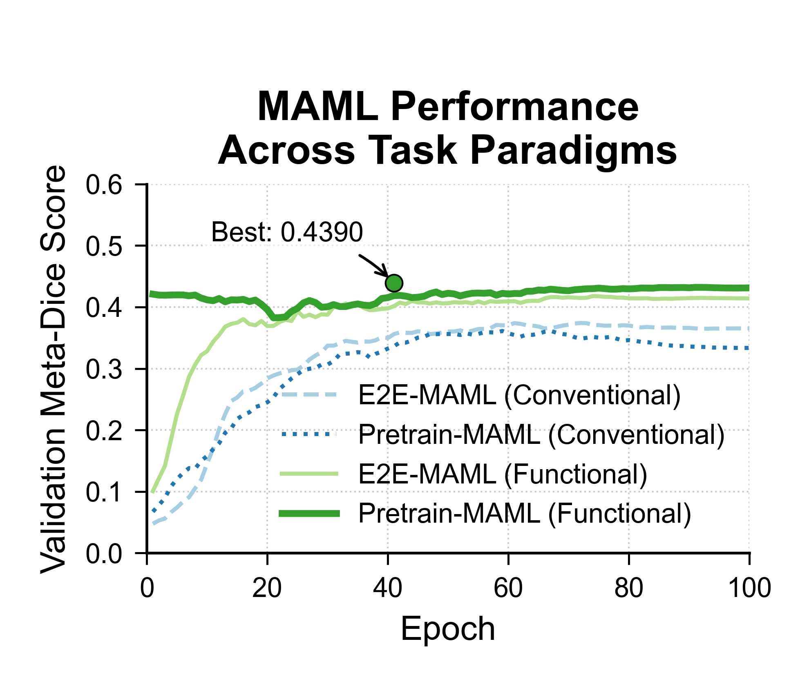

# Functional Task Engineering Unlocks Meta-Learning for Medical Image Segmentation

<!-- [](https://arxiv.org/abs/XXXX.XXXXX) -->
[](https://opensource.org/licenses/MIT)

<!-- 
    第一段：项目的电梯演讲。
    建议：将 [Your Paper's Tentative Title] 替换为你的论文暂定标题。
-->
This repository contains the official PyTorch implementation for our research study: "Task Engineering as a Catalyst for Meta-Learning in Medical Image Segmentation". 

In this work, we systematically investigate the application of Model-Agnostic Meta-Learning (MAML) for multi-site stroke lesion segmentation. We discover that the success of meta-learning critically hinges on task design. We propose a **Functional Task Engineering (FTE)** paradigm that leverages clinical metadata to construct tasks based on pathological properties (e.g., lesion anatomical location), which significantly boosts MAML's few-shot adaptation performance.

> **Note:** This research is currently in preparation for submission. A link to the preprint or published paper will be added here upon availability.

<!-- 
    核心结果图：这是你仓库的“门面”。
    建议：1. 确保这张图是你最终、最漂亮的版本。
          2. 将图片上传到你的GitHub仓库的一个新文件夹里（例如 `figures/`）。
          3. 将下面的 `path/to/your/plot.png` 替换为正确的相对路径，例如 `figures/final_dice_comparison_plot_smoothed.png`。
          4. 取消注释以显示图片。
-->
<!-- 

*Figure: Comparison of MAML performance on conventional (domain-based) tasks vs. our proposed functional tasks.*
-->

## 📋 Table of Contents
<!-- 
    目录：这部分是自动生成的，你不需要修改。它会让你的README结构更清晰。
-->
- [Installation](#installation)
- [Dataset and Preprocessing](#dataset-and-preprocessing)
- [Usage](#usage)
- [Results](#results)
- [Citation](#citation)
- [Acknowledgements](#acknowledgements)

## ⚙️ Installation

1.  Clone this repository:
    ```bash
    git clone https://github.com/lanievesi828/meta-learning-of-stroke-segmentation.git
    cd [YourRepoName]
    ```

2.  Create a Conda environment and install dependencies. We recommend using Python 3.9+.
    ```bash
    conda create -n maml-stroke python=3.9
    conda activate maml-stroke
    pip install -r requirements.txt
    ```
    
    A `requirements.txt` file is provided. Key dependencies include:
    - PyTorch (`>=1.10`)
    - Torchvision
    - opencv-python-headless>=4.5
    - albumentations>=1.1.0
    - pandas>=1.5.0
    - scikit-image>=0.19.0
    - numpy>=1.21.0
    - nibabel>=4.0.0
    - tqdm
    - matplotlib>=3.4.0
    - openpyxl
    - seaborn
    - tqdm

## 💾 Dataset and Preprocessing

### Dataset

This study is based on the publicly available **ATLAS v2.0 dataset**. You can request access from their official website: https://fcon_1000.projects.nitrc.org/indi/retro/atlas.html.

### Preprocessing

Due to the dataset's size and licensing, we cannot provide the data directly. However, we provide the full preprocessing scripts to generate the required datasets from the raw NIfTI files.

1.  **Download and organize the raw data

2.  **Run the Functional Task Preprocessing:**
    - Open `src/preprocessing_v4_functional.py`.
    - Modify the `data_folder`, `metadata_file`, and `output_base_folder` paths in the `CONFIG` dictionary.
    - Run the script:
      ```bash
      python -m src.preprocessing_v4_functional
      ```
    - This will generate the `maml_data_functional_tasks` directory, containing all processed `.npy` slices and the crucial `..._functional_meta_tasks.json` files.

## 🚀 Usage

All training and evaluation scripts are located in the `src/` directory. Before running, please update the paths in `src/config.py` to point to your preprocessed data directories.

### 1. Standard Supervised Learning (SSL)
This script trains the global SSL model on the functional dataset.
```bash
python -m src.baseline_train # Rename this script if needed
```

### 2. End-to-End MAML Training
This script runs E2E-MAML training from random initialization.
```bash
# Ensure PRETRAINED_MODEL_PATH in config.py is set to None or an invalid path
python -m src.train_maml
```

### 3. Pretrain-MAML Training
This script runs MAML training starting from the best SSL model.
```bash
# Ensure PRETRAINED_MODEL_PATH in config.py points to the best_model.pth from the SSL run
python -m src.train_maml 
```

### 4. SSL+Finetune Evaluation
This diagnostic script evaluates the few-shot performance of the SSL model.
```bash
# Ensure SSL_MODEL_PATH in the script points to the best_model.pth from the SSL run
python -m src.evaluate_ssl_finetune
```

## 📊 Results

Our key finding is that Functional Task Engineering significantly improves MAML's performance. The final performance comparison on our internal validation set is as follows:

| Method (Functional Tasks) | Evaluation | Dice Score |
| :--- | :--- | :--- |
| Pretrain-MAML | Few-shot | **0.4390** |
| E2E-MAML | Few-shot | 0.4241 |
| SSL+Finetune | Few-shot | 0.3113 |
| SSL | Global | 0.5273 |

Please see our manuscript for a detailed analysis and discussion of these results.

## 📜 Citation

Our paper is currently in preparation. If you find our work and code useful for your research, we would appreciate it if you could cite this repository for now. A full BibTeX citation will be provided upon publication.

You can use the following temporary citation:
```bibtex
@misc{Xueqi Yan2025fte,
  author       = {Xueqi Yan and Huan Wang},
  title        = {Functional Task Engineering Unlocks Meta-Learning for Medical Image Segmentation},
  year         = {2025},
  publisher    = {GitHub},
  journal      = {GitHub repository},
  howpublished = {\url{https://github.com/lanievesi828/meta-learning-of-stroke-segmentation}}
}
```

## 🙏 Acknowledgements
We gratefully acknowledge the creators of the ATLAS v2.0 dataset for making this valuable resource publicly available. This work was supported by Shijiazhuang Tiedao University.